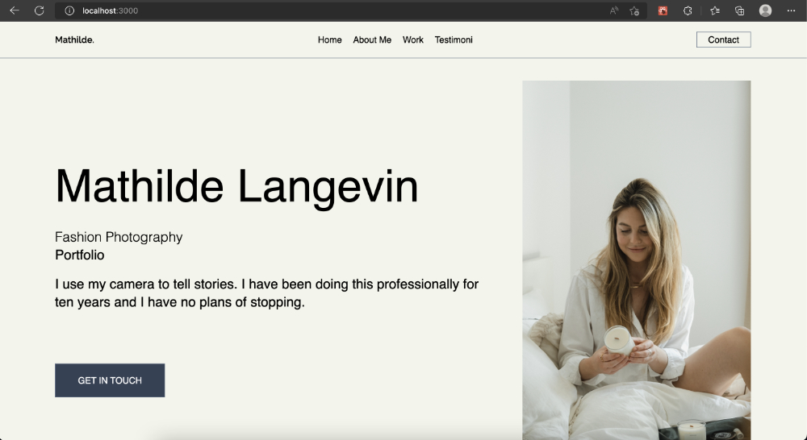

## Membuat Portfolio Website
Membuat portfolio website menggunakan NextJS, Tailwind, dan Vercel

## Screenshots



First install dependency and run the development server:

```bash
npm install
# then
npm run dev
# or
yarn dev
```

Open [http://localhost:3000](http://localhost:3000) with your browser to see the result.
